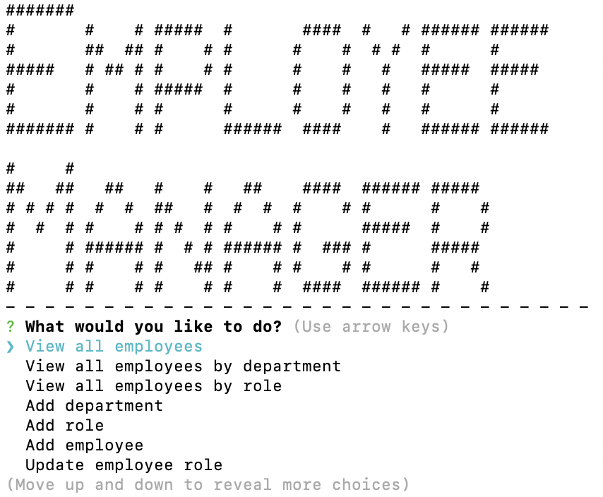
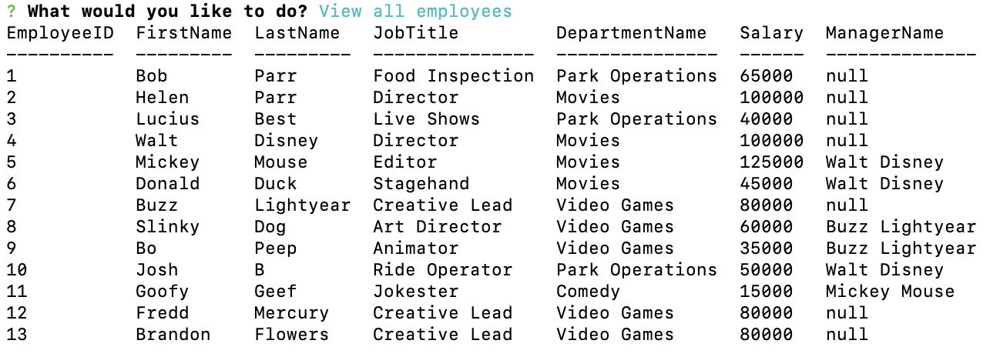
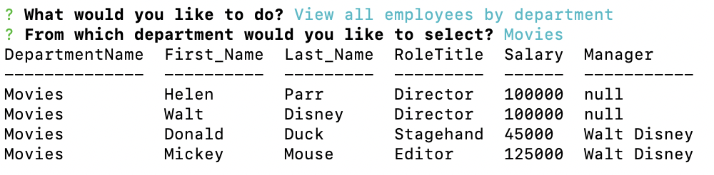
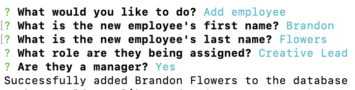
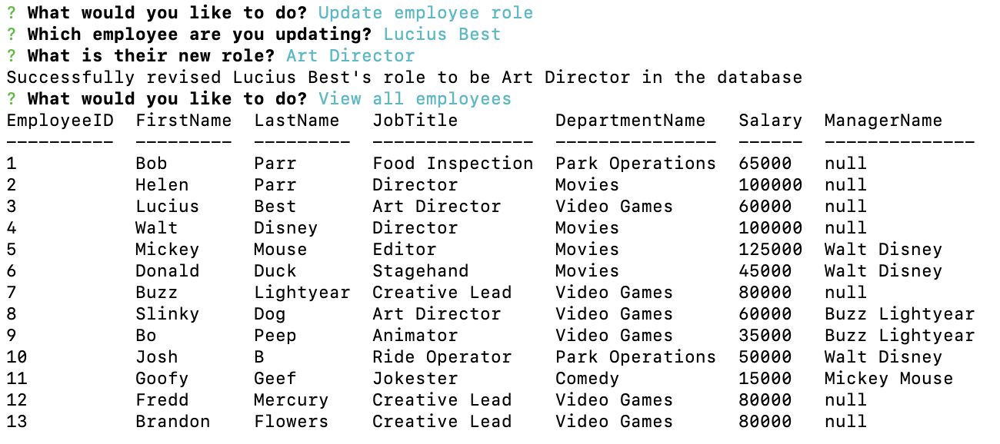

# MySQL-Employee-Tracker

## DESCRIPTION
A node.js command-line application that interfaces with MySQL, allowing the user to dynamically manage and update an employee database

## SCREENSHOTS
### Main Menu of the Application

### View All Employees

### View All by Department

### Adding an Employee

### Updating an Employee's Role

## TABLE OF CONTENTS
* [Installation](#installation)
* [Usage](#usage)
* [License](#license)
* [Contributing](#contributing)
* [Refinements](#refinements)
* [Questions](#questions)
    
## INSTALLATION
- Clone the repo for use on your local machine
- Use the command line to locate the cloned repo and make it your current directory
- Type `npm install` in the command line
- This will install the node module packages and dependencies, including inquirer and MySQL, which are necessary for proper application functionality
- Use the `employeeSchema.sql` and `employeeSeeds.sql` files to create and seed the database with initial data

## USAGE
- To use the "MySQL Employee Tracker" application...
- (This assumes that the database has been created and seeded)
- Use the command line to locate the cloned repo and make it your current directory
- Simply type `node index.js` in the command line
- A series of prompts will inquire about the following items:
    - View All Employees
    - View All Employees by Department
    - View All Employees by Role
    - Add department
    - Add role
    - Add employee
    - Update employee role
    - Exit
- Many of these prompts have subsequent sub-prompts, asking for additional information
- Once the necessary information has been collected, calls are made to and from the MySQL database

### [Video](https://drive.google.com/file/d/1c4Eg0EGGdQE33iuA1qWGoQZjfEtROn11/) showing usage of the successfully deployed application:
[https://drive.google.com/file/d/1c4Eg0EGGdQE33iuA1qWGoQZjfEtROn11/](https://drive.google.com/file/d/1c4Eg0EGGdQE33iuA1qWGoQZjfEtROn11/)

## LICENSE
License: MIT License 
[https://opensource.org/licenses/MIT](https://opensource.org/licenses/MIT)

## CONTRIBUTING
[https://github.com/JPBrickhouse](https://github.com/JPBrickhouse)

## REFINEMENTS
While the application works beautifully, there is always opportunity for improvement and refinement:
- Utilize constructors to standardize the creation and syntax of MySQL calls
- Instead of using nested functions and commands, compartmentalize individual tasks contained within separate functions, and simply call to those functions
- Attempt to DRY out the code (i.e. "Don't repeat yourself")

## QUESTIONS
Feel free to visit the following GitHub for more information:
[https://github.com/JPBrickhouse](https://github.com/JPBrickhouse)
